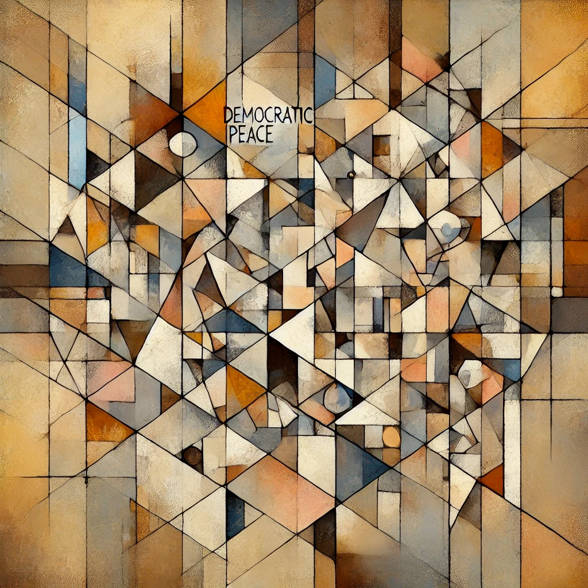

# Abstractions of Freedom; What Colour Are Your Bits?; AI and Translation Across Mediums

##  Research / Theory

### Freedom (liberty) and abstraction

- A quick exercise reflecting on freedom or liberty in Sen & Nussbaum's work. Defining freedom / non-freedom requires going up and down the ladder of abstraction (see @Cartwright_2012_EvidencebasedPolicyPractical for an extended discussion of traversing abstraction).
#### Highest: Quality / Quantity

- At most abstract, there are two coefficients for freedom or agency as understood by Sen. Life quantity (longevity) and life quality (life states accessible during time). Between the two, the quality budget abstracts far more complexity (health, political action, economic, cultural, etc.). Compared to longevity, which is measured ≈losslessly with a single number (time lived).

#### Medium: Quantity, plus Positive+Negative Liberties

- Besides quantity, we can add go down one layer of abstraction to consider positive and negative liberties. Sen emphasizes that the capabilities approach must include both. While people are alive, development should maximize both their freedom from interference, which is negative liberty, and ability to self-actualize desires by maximizing enabling factors (e.g. education, access to markets/goods, etc.), which is positive liberty.

#### ≈Low: Quantity and Specific Categories of Quality

- Since quantity is already basically lossless as a measure, a relatively low level of abstraction[^1] would be to specify the specific, though still major, domains of human action. These may include ["health", "goods", "social relations", "political freedom", "economic freedom", "social freedom"]. Essentially, the first three (health, goods, and social relations), are positive liberties, while the last three are the negative liberties.
	- **Health**: is the ability for human bodies to function to achieve ends.
	- **Goods**: is the ability to access goods, through either a market or other, to provide for one's needs.
	- **Social relations**: is the ability to satisfy social desires, such as family, friends, etc.
	- **Political freedom**: is the ability to act politically towards the existing government or regime.
	- **Economic freedom**: is the ability to pursue meaningful work and exchange uninhibited.
	- **Social freedom**: is the ability to interact with other humans and the broader work (animals, nature) uninhibited.

[^1]: I use ≈ because this category could be endlessly split into more specific freedoms (e.g. the freedom to walk a dog backwards on the Tuesday after the April's first rain.)

### What colour are your bits? 

- This article by Matthew Skala essentially asks: [why does copyright seem ontologically incompatible (and even silly) to computer science?](https://ansuz.sooke.bc.ca/entry/23)
- TLDR: For computer science (CS), data as bits does not have, and *cannot have* authorship direct in the data. Authorship or information on usage (e.g. intended only for use by...) is metadata by definition. The idea of copying patterns directly (identical 00s and 11s) is fundamental. Computers *cannot* see authorship or usage because they are machines (ones and zeros). Related to 'abstractions always leak'.
	- Skala uses the game Paranoia as a metaphor for the ontological gap between law and computer science in addressing copyright. In Paranoia, everyone is assigned an authorization along the visible light spectrum (red to ultraviolet). Interacting with higher spectra is forbidden. Lawyers 'see' this metadata (color) at inherently true, but computer science fundamentally does not. Computer scientists know, and their training requires them to understand, that metadata is *additional* to the original data. This requires understanding computers, rather than just the abstractions on top.
	- Computer science sees copying a pattern **void of author metadata**. That is, computer scientists see authorship at *additional meta-data* which must be added. Bits and binary on a computer do not inherently possess authorship information. 
	- Fundamentally, computer science **cannot** not support copyright. A pattern cannot possibly be reliably traced to a source without attaching additional data. The data itself can never be forced to include authorship meta-data. 
	- **John Cage's 4'33" is a perfect example**. An empty mp3 is identical to his composition. However, a copyright lawyer may argue that he 'owns' that silence *if it was copied from his album, versus someone simply compressed silence into an identical mp3 for 4min 33 sec*. This is ridiculous to a CS, but meaningful to a lawyer, because only lawyers see copyright above the natural existence of bits, which are not inherently attributable. At the extreme of *no data*, this becomes ridiculous.
	- Another excellent example:  [on the US Naval Observatory Web site](http://aa.usno.navy.mil/faq/docs/lawyers.html), they state that you cannot use sunset/rise times in court. Court requires an 'expert'. It is patently ridiculous, unless you are a lawyer who sees the law as meaningful rules of the game (or metadata) atop the reality of sunrise/set.
### AI as *Medium* (not just language) Translation

- Dimitri Glazkow has a fascinating  [blogpost](https://whatdimitrilearned.substack.com/p/2024-04-01) titled 'flexibility of the medium' where he describes switching two blogs into lyrics (ChatGPT), then into a song (Suno). He could have also put them into an image with DALLE / Midjourney.
- Here, the **message** is ≈ consistent, but the **medium** is changing.
- The cost of this used to be enormous, requiring, requiring a deep domain expertise of the content *and* the meta-knowledge of **both** mediums. Such interpolation ability is extremely rate for humans. But, because AI has near-universal compression of how different media operates (e.g. a BBC newscast vs. a sesame street episode), it it is fairly trivial to translate content between these media contexts. However, more interestingly than BBC to sesame street. 
	- AI can also translate between media itself (not just sub-media environments, such as BBC and sesame street). AI can go text --> visual --> auditory. 
	- For example, how would Picasso draw the notion of democratic peace theory drawn from a Brookings Report (ask Midjourney or ChatGPT)?:
	
	- How would the Strokes represent it in a song? - Suno can write an indie rock song "[democratic peace](https://suno.com/song/dac8fc73-794d-44be-95ee-7beb9137001d)"
- We think of translation across languages, but mediums are essentially meta-languages (encoded in sound vs. script vs. pixels). Of course, each of these is mediated by silicon / binary for LLMs (and their non-language generative AI analogs) to work.
- Importantly, he as the curator / editor was 'in the loop' across the way, helping shepherd his message between mediums.
- Smaller examples of this are switching the ton / complexity of the same MESSAGE across audiences (kids, pre-schoolers, illiterate, blind etc.). 
- He also describes the lossiness of this. AI may get things wrong, or some messages may struggle to cross domains (e.g. highly technical or abstract math seems difficult to capture via pointillism.. maybe.) However, the Human in the Loop (AI) makes this less dangerous. A human who understand something in one medium deeply, may more-or-less reliably judge its fidelity in another, albeit with varying degrees of subjectivity.

### Bateson's Double Habit of Mind (from Anthea Roberts)

- Roberts write that Bateson oscillated between 'loose' and 'strict' thinking. Drawing wild analogies, and then subjecting them to (strict) scientific scrutiny. This is drawn from Bateson's *Steps to an Ecology of Mind* [-@Bateson_1972_StepsEcologyMind].
	- Wild analogies: "Is a system radially symmetric like a jellyfish or symmetrical in a transverse way like a lobster" - Roberts, quoting Bateson.
- Combine abductive logic, in the [Peircean sense](https://plato.stanford.edu/entries/abduction/peirce.html) (likely via System 1) to generate bold, cross-disciplinary theories, and then transition to deductive via rigorous methods (certainly System 2). This cyclical interplay drives scientific progress.

---